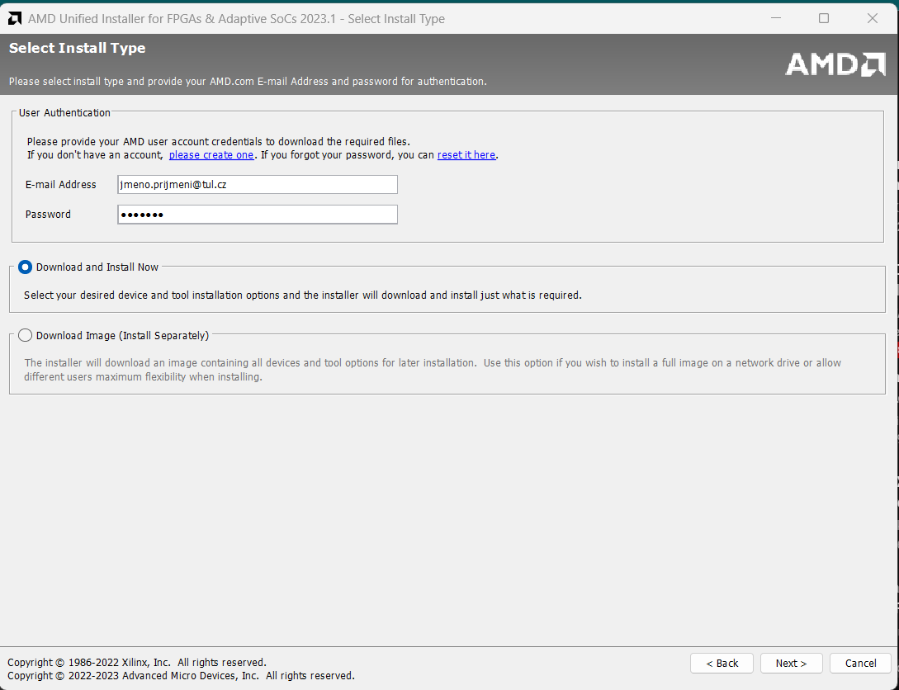
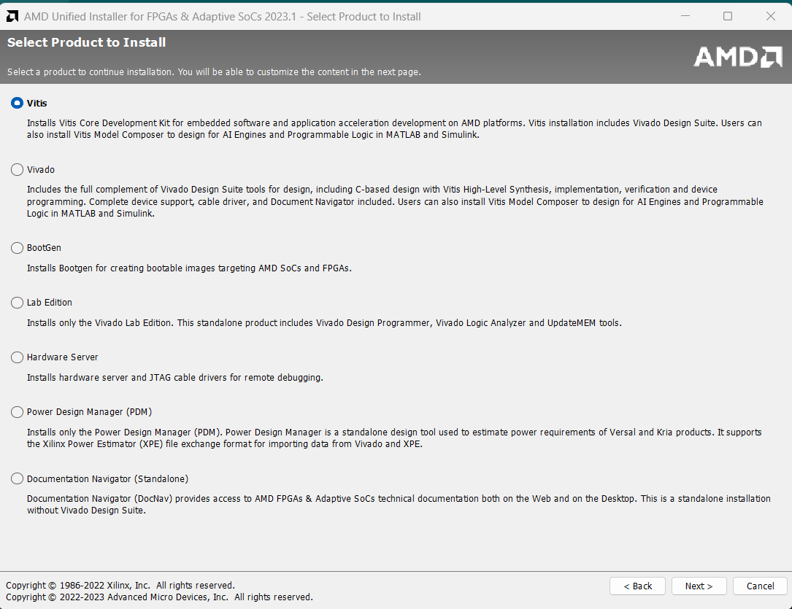
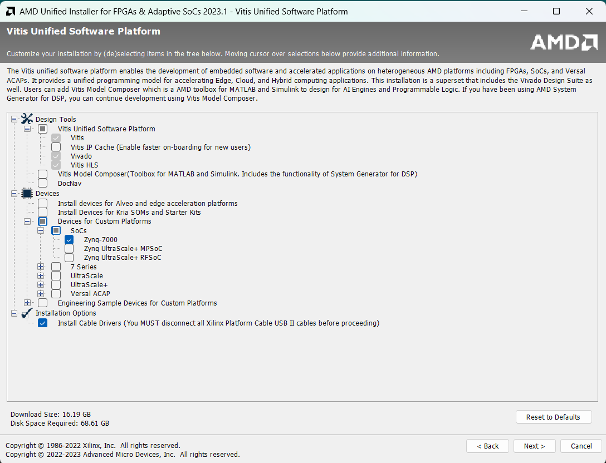
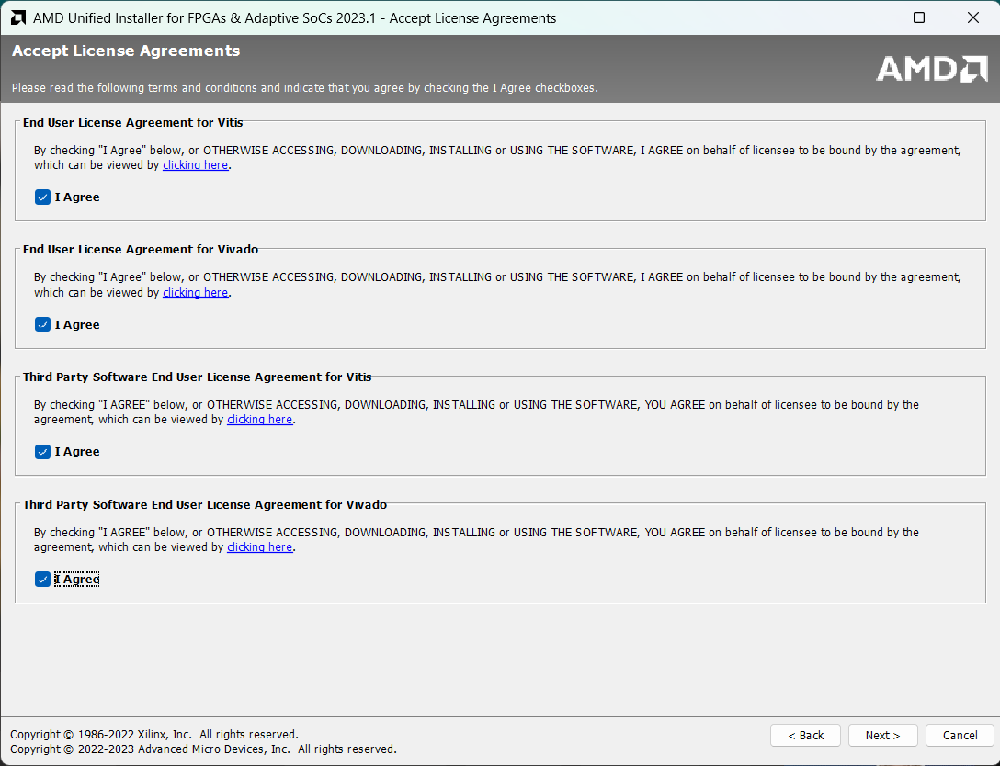
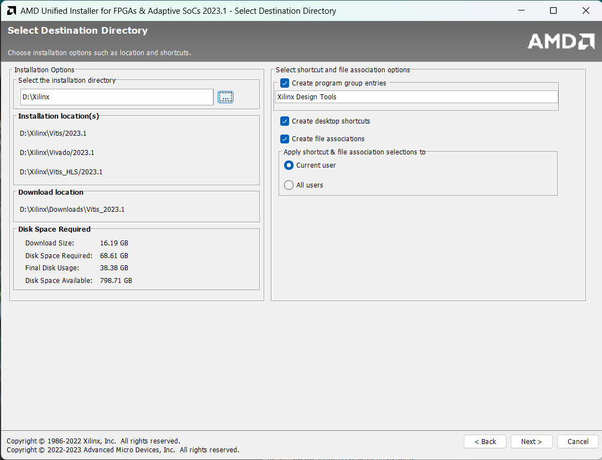
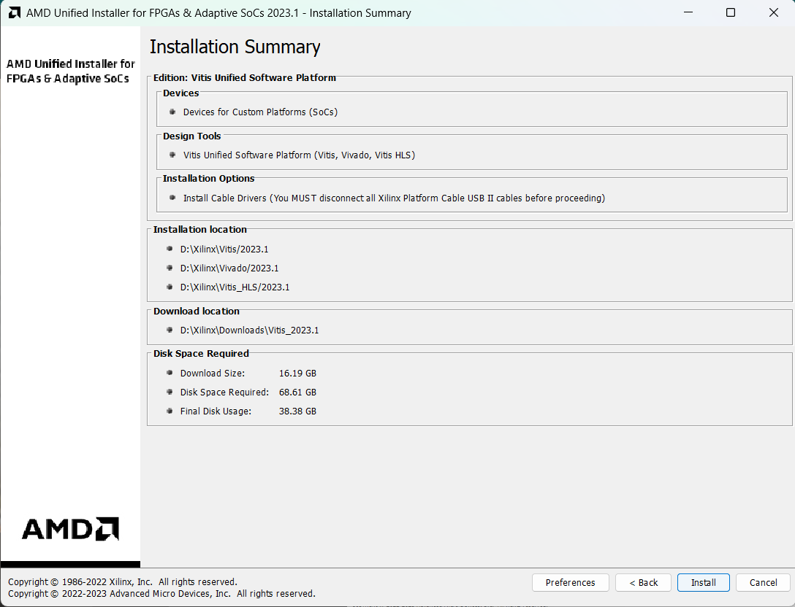
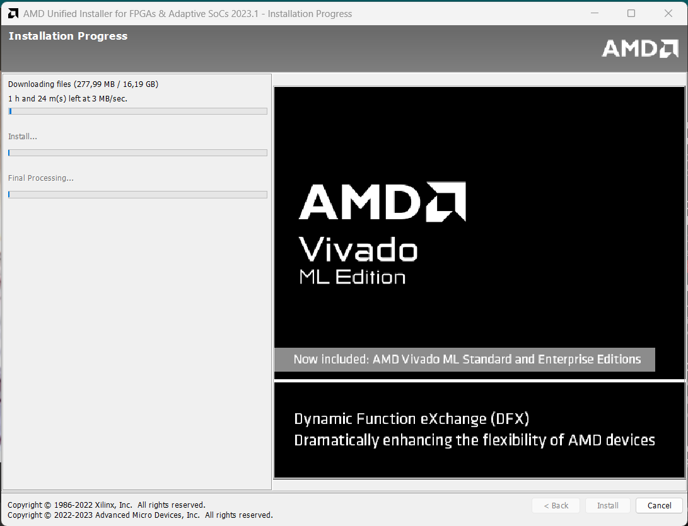
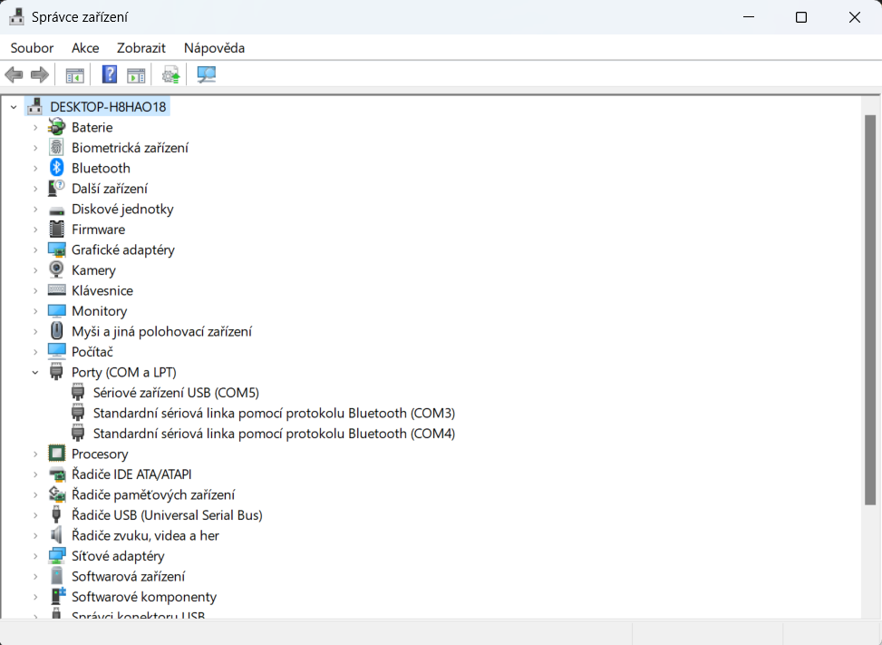
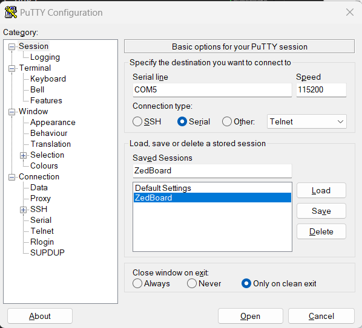

### use case DOKUMENTACE
- jak zprovoznit a testovat můj akcelerátor například pro oponenta mojí práce nebo technicky znalého bastléra
- předpokládá se, že má vývojovou FPGA desku, je technicky znalý, a umí se pohybovat v technicky složitých dokumentech
- návod bude číst dost v elektronické formě v teple, suchu z monitoru u kafíčka a bude se snažit všechno pochopit, ale zároveň ho bude tlačit čas, takže bude chtít co nejrychleji zprovoznit a testovat akcelerátor
---
### struktura dokumentace
1. Zprovoznění HW
   - jak připojit desku k počítači
   - jak najít konktrétní desku v Xilinx Vitis
   - mapování portů na FPGA desce ZedBoard
2. Zprovoznění SW
   - vložení kódu do projektu v Xilinx Vitis
   - syntéza, elaborovaný design
3. Testování
   - použítí testbenche
   - jak spustit testy
   - interpetace výsledků
  
---

# Dokumentace

## 1. Stažení instalace a nastavení prostředí pro kompilaci a testování

### 1.1 Stažení
Ze stránek AMD-Xilinx stáhneme instalační balíček Vivado ML Edition - 2023.1
url: https://www.xilinx.com/support/download/index.html/content/xilinx/en/downloadNav/vitis.html

Pro stažení je nutné se zaregistrovat a vyplnit dotazník. Po vyplnění dotazníku se zobrazí stránka s odkazem na stažení instalačního balíčku.

### 1.2 Instalace
Instalace probíhá podle návodu na stránkách AMD-Xilinx. Instalace je velmi jednoduchá a probíhá v grafickém rozhraní. Instalace zabere cca 1,5 hodiny a zabere cca 70GB místa na disku.s

Pokud si nejste jistí celou instalací vás provedou následující snímky obrazovky.

Úvodní stránka instalace, je doporučeno při instalaci vypnout antivirový program, který může instalaci zpomalovat a taktéž zajistit že instalici nepřeruší spánkový režim počítače.

Stránka s přihlášením, zde je nutné se přihlásit pomocí účtu, který jste si vytvořili při stažení instalačního balíčku a být připojen v rámci sítě TUL nebo VPN.

Zde je důležité zvolit instalaci produktu Vitis. 

Nejdůležitější krok instalace, v tomto kroku je nutné vybrat všechny zařízení, která chceme používat. V našem případě je nutné vybrat pouze Zynq-7000. Vše ostatní můžeme odznačit a tím ušetříme místo na disku. Taktéž ještě zvolíme instalaci ovladačů pro kabelovou komunikaci s deskou.

Stránka s licenčními podmínkami, je nutné souhlasit s licenčními všech produktů, které jsme vybrali v předchozím kroku. To může být poněkud otravné, ale jinak vás instalace dál nepustí.

Zde je možné zvolit místo, kam se mají nainstalovat všechny produkty. Doporučuji nechat výchozí cestu, která je nastavena na C:\Xilinx. Pokud byste chtěli instalovat na jiné místo, je nutné mít na paměti, že **cesta nesmí obsahovat mezery a diakritiku** a musí být kratší než 100 znaků.

Souhrn instalovaných produktů, dobré je zkontrolovat, že jsme vybrali k instalaci Vitis zkontrolovat instalační cestu.

Instalace probíhá, je nutné počkat až se instalace dokončí. Stahování instalačních souborů může trvat i několik hodin v závislosti na rychlosti internetového připojení a rychlosti diskového úložiště.

Máte nainstalovano? Tak to je super, pokud jste se dostali až sem, tak už jste skoro v cíli. Teď je potřeba nastavit prostředí pro kompilaci a testování. To provedeme v následujícím kroku.


### 1.3 Nastavení prostředí
Ve složce Xilinx musíme před spuštěním vytvořil licenční soubor "LM_LICENSE_FILE" a vložit následující řádek:
```
1717@license.tul.cz
```
a soubor uložit. Tím se software může spojit s licenčním serverem TUL a můžeme začít s připojením desky.

## 2. Připojení, nastavení HW
Co budeme potřebovat:
- desku digiland ZedBoard 
- 2x USB typ B - micro USB kabel
- napájecí zdroj 5V/2A a napájecí kabel
- PC s nainstalovaným Xilinx Vitis
- složku se zdrojovými kódy 
- PuTTY nebo jiný terminál podporující sériovou komunikaci 
  
Dále budeme potřebovat připojit desku k PC pomocí USB kabelů, jeden USB kabel slouží pro pro účelý programování desky a druhý kanál pro sériovou komunikaci mezi deskou a PC. Pak stačí jenom desku napájet pomocí napájecího zdroje. Po připojení desky k PC se nám v zařízeních objeví nové zařízení COM. 
Na windows pomocí Správce zařízení, kde si zjistíme na jakém COM portu je deska připojena.

Na linuxu pomocí příkazu **lsusb -v**, kde se nám vypíše seznam všech připojených zařízení USB s podrobnými parametry.

### 2.1 Připojení k desce
Po připojení desky k PC a zjištění COM portu, můžeme spustit PuTTY a nastavit sériovou komunikaci na daném COM portu. Nastavení jsou následující:
- *Connection type* nastavíme na *Serial*,
- do pole *Serial line* zadáme COM port, na kterém je deska připojena, v mém případě je to COM5,
- *Speed* nastavíme na 115200
- a můžeme si to uložit do profilu, abychom to nemuseli nastavovat při každém spuštění PuTTY,
- a nakonec stačí jenom kliknout na tlačítko *Open* a otevře se nám okno s terminálem.




### 2.2 Nastavení projektu
Nyní můžeme otevřít vývojovové prostředí Vitis a otevřít existující projekt se samotným řešením. Najdeme tedy místo kde máme uloženou složku *testip\vitis* a spustíme

Otevře se nám vývojové prostředí a něm soubor main, zde je implementace kódu enkodéru do JPEG v jazyku C a také připravené volání funkce pro testování řešení vytvořeného na desce ZedBoard. Tím je nastavení hotové a můžeme přejít k samotnému testování. Otevřené vývojové prostředí by mělo vypadat následovně:


## 3 Testování

### 3.1 Testovácí data
Pro testování byl vybrán příklad z wikipedie [JPEG](https://en.wikipedia.org/wiki/JPEG) a to konkrétně vstupní matice 8x8 pixelů vybraná z obrázku [Lenna](https://en.wikipedia.org/wiki/Lenna). Vybraný makroblok vstupních dat je následující:
```
[52, 55, 61, 66, 70, 61, 64, 73]
[63, 59, 55, 90, 109, 85, 69, 72]
[62, 59, 68, 113, 144, 104, 66, 73]
[63, 58, 71, 122, 154, 106, 70, 69]
[67, 61, 68, 104, 126, 88, 68, 70]
[79, 65, 60, 70, 77, 68, 58, 75]
[85, 71, 64, 59, 55, 61, 65, 83]
[87, 79, 69, 68, 65, 76, 78, 94]
```
odkud se po kompresi získá následující výstupní matice:
```
[-26,-3, 0,-3,-2,-6, 2,-4]
[ 1,-3, 1, 1, 5, 1, 2,-1]
[ 1,-1, 2, 0, 0, 0, 0, 0]
[-1,-1, 0, 0, 0, 0, 0, 0]
[ 0, 0, 0, 0, 0, 0, 0, 0]
[ 0, 0, 0, 0, 0, 0, 0, 0]
[ 0, 0, 0, 0, 0, 0, 0, 0]
[ 0, 0, 0, 0, 0, 0, 0, 0]
```
Po RLE by výstupní komprese měla vypadat následovně (graficky zobrazená pro naše účely):
```
(0,5)(-26);(0,2)(-3);(1,2)(-3);(0,2)(-2);(0,3)(-6);(0,2)(2);(0,3)(-4);(0,1)(1);(0,2)(-3);(0,1)(1);(0,1)(1);(0,3)(5);(0,1)(1);(0,2)(2);(0,1)(-1);(0,1)(1);(0,1)(-1);(0,2)(2);(5,1)(-1);(0,1)(-1);(0,0)(0);
```

### 3.2 Testování
Kód pro testování je v souboru *main.c* pro spuštění testu je nutné celý projekt postavit, vytvořit tak potřebné soubory a k nahrání na desku. To lze udělat klávesovou zkratkou **Ctrl + B** nebo v menu *Project* vybrat *Build Project*. Po úspěšném postavení projektu se nám v terminálu objeví výpis "Build Finished" (pokud by došlo k chybě, okamžitě me kontaktuje)

Můžeme proto přistoupit k nahrání souboru na desku. To provedeme klávesovou zkratkou **Ctrl + F5** nebo v menu *Run* vybrat *Run As* a poté *Launch on Hardware (System Debugger)*. Po úspěšném nahrání souboru se nám v terminálu objeví výpis "Program downloaded to FPGA" (pokud by došlo k chybě, okamžitě me kontaktuje)

### 3.3 Výsledky testování
Tím jsme spustili testy a jejich výsledek můžeme vidět v Putty terminálu. Výsledek testu je následující:
```
Test 1:
JPEGenc test application

source macroblock:

0: 0052 0055 0061 0066 0070 0061 0064 0073

1: 0063 0059 0055 0090 0109 0085 0069 0072

2: 0062 0059 0068 0113 0144 0104 0066 0073

3: 0063 0058 0071 0122 0154 0106 0070 0069

4: 0067 0061 0068 0104 0126 0088 0068 0070

5: 0079 0065 0060 0070 0077 0068 0058 0075

6: 0085 0071 0064 0059 0055 0061 0065 0083

7: 0087 0079 0069 0068 0065 0076 0078 0094

Setup done in 854 ticks, run in 311 ticks

computed zig-zagged quantized 2D DCT:

0: -026 -003 0000 -003 -002 -006 0002 -004

1: 0001 -003 0001 0001 0005 0001 0002 0000

2: 0001 -001 0002 0000 0000 0000 0000 0000

3: -001 -001 0000 0000 0000 0000 0000 0000

4: 0000 0000 0000 0000 0000 0000 0000 0000

5: 0000 0000 0000 0000 0000 0000 0000 0000

6: 0000 0000 0000 0000 0000 0000 0000 0000

7: 0000 0000 0000 0000 0000 0000 0000 0000

STATUS: DATA_VALID = TRUE

RLE:
   
   (0,5)(-26);(0,2)(-3);(1,2)(-3);(0,2)(-2);(0,3)(-6);(0,2)(2);(0,3)(-4);(0,1)(1);(0,2)(-3);(0,1)(1);(0,1)(1);(0,3)(5);(0,1)(1);(0,2)(2);(0,1)(-1);(0,1)(1);(0,1)(-1);(0,2)(2);(5,1)(-1);(0,1)(-1);

RLE done in 0.012 ms
Test 2:

Speed test. Random Image 1024*8 repeated 96 times

Image done in 1568744 total. Setup done in average 525 ticks, run in average 15815 ticks

RLE done in 1.14 ms
```
V prvím testu jsou porovnány výsledky výstupu z desky a kódovým řešením v C, že se výsledky schoduji či nikoliv nám oznámí výpis **DATA_VALID** taktéž můžeme porovnat graficky výsledek s referenčním výstupem a zjistit, že se nám výstupní matice shoduje.

V druhý test měří rychlost komprese na větším množství dat. Pro tento test se 96krát vytvoří náhodná matice a měří se počet tiků, které zabere komprese jedné matice a počet tiků, které zabere komprese všech 96 matic. 1 tik odpovídá 3ns, tedy 1ms odpovídá 333 333 tikům. Časové porovnání výsledků je kompxenější téma a je popsáno v kapitole 4.4. Testování mojí bakalářské práce.

Pokud byhom takto chtěli komprimovat realný obraz, bylo by nutné upravit kód tak, aby se vstup načítal ze vstupních periférii desky a výstup zapisoval na výstupní periférie desky. Což není vůbec snadné a je mimo rozsah této práce.

V případě touhy po větším poznání více informací naleznete v kapitole 4.4. Testování mojí bakalářské práce.

autor: @KNajman